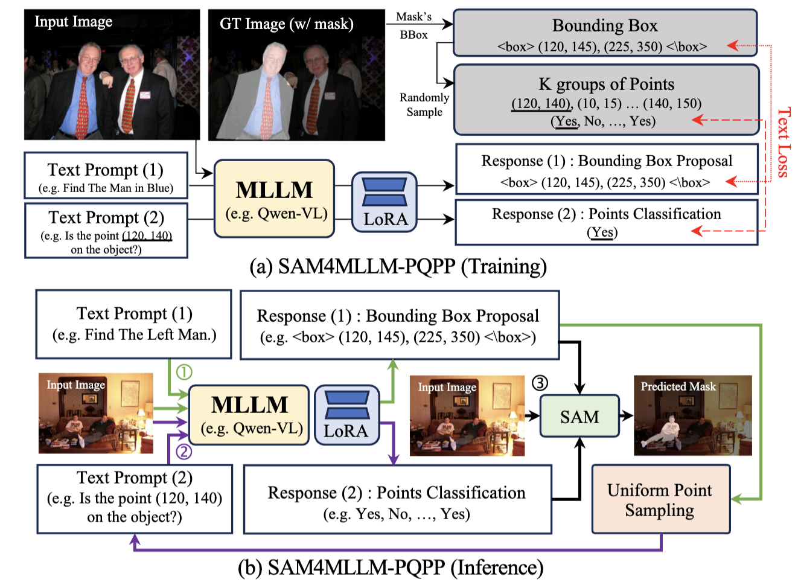

# SAM4MLLM
This is the implementation of "SAM4MLLM: Enhance Multi-Modal Large Language Model for Referring Expression Segmentation"





## Dataset Preparation
Download each dataset from website:
- [ADE20K](https://groups.csail.mit.edu/vision/datasets/ADE20K/)
- [PACO-LVIS](https://github.com/facebookresearch/paco/tree/main)
- [Part-ImageNet](https://github.com/TACJu/PartImageNet)
- [RefCOCO](https://github.com/lichengunc/refer)
- [GRES](https://github.com/henghuiding/ReLA)


Put all of them under data directory so you should get:

```
    SAM4MLLM/
    ├──dataset/
    |  ├──ADE20K/
    |  ├──PACO-LVIS/
    |  ├──Part-ImageNet/
    |  ├──RefCOCO/
    |  ├──GRES/
```


## Installation
- pytorch==2.1.2
- transformers==4.42.4
- peft==0.11.1
- lightning==2.3.3
- FlashAttention2(optional)
- LLaVA-NeXT: Follow instruction in https://github.com/LLaVA-VL/LLaVA-NeXT
    - The version of LLaVA-NeXT we used is [here](https://github.com/LLaVA-VL/LLaVA-NeXT/tree/8f0502567954dab2db5a620b2feed48734d6aed9).
- EfficientVIT-SAM: Follow instruction in https://github.com/mit-han-lab/efficientvit

## Checkpoint
Download each checkpoint:
- [llava-next (llama 3)](https://huggingface.co/lmms-lab/llama3-llava-next-8b)
- [Efficient-VIT-SAM](https://huggingface.co/han-cai/efficientvit-sam/resolve/main/xl1.pt)
- [SAM4MLLM](https://drive.google.com/drive/folders/1KH7hnDY8W7lXNHGtCbloA5jlWMZ0vgND?usp=drive_link)
- [SAM4MLLM+](https://drive.google.com/drive/folders/1ytEfGRa6bxThTXQn5MLVKKy4jsxxBo6M)
- [SAM-Decoder (finetuned on Coco dataset)](https://drive.google.com/drive/folders/14burV34SxcQnxqkoiQ9Ax-OB26XmSf8S?usp=drive_link)

Put all of them under checkpoint directory so you should get:
```
    SAM4MLLM/
    ├──checkpoint/
    |  ├──llama3-llava-next-8b/
    |  ├──sam4mllm/
    |  ├──sam4mllm_plus/
    |  ├──xl1.pt/
    |  ├──effvit_xl1_decoder_coco_ft.pt
```
## Data pre-process

- Rearrange data

In data, Run each jupyter notebook to generate dataset for training.

- Convert the data into dialouge format:

```
python to_chat_format.ipynb
```

## Traning
```
python sam4mllm_train.py
```

## Inference 
Run simple_infer.ipynb


## Licenses
Copyright © 2024, NVIDIA Corporation. All rights reserved.

This work is made available under the NVIDIA Source Code License-NC. Click [here](https://github.com/AI-Application-and-Integration-Lab/SAM4MLLM/blob/main/LICENCE) to view a copy of this license.
