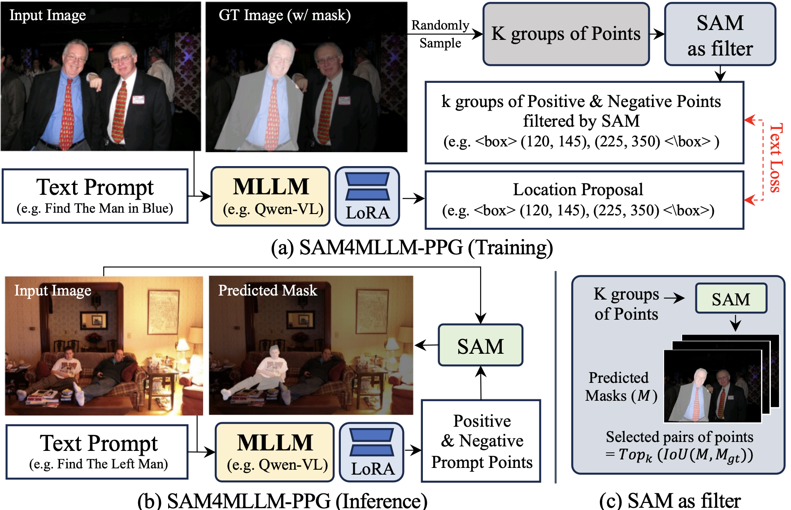

# SAM4MLLM
This is the implementation of our ECCV'24 "SAM4MLLM: Enhance Multi-Modal Large Language Model for Referring Expression Segmentation"





## Dataset Preparation
Download each dataset from website:
- ADE20K:https://groups.csail.mit.edu/vision/datasets/ADE20K/
- PACO-LVIS: https://github.com/facebookresearch/paco/tree/main
- Part-ImageNet:https://github.com/TACJu/PartImageNet
- RefCOCO: https://github.com/lichengunc/refer
- GRES: https://github.com/henghuiding/ReLA


Put all of them under data directory so you should get:

```
    SAM4MLLM/
    ├──dataset/
    |  ├──ADE20K/
    |  ├──PACO-LVIS/
    |  ├──Part-ImageNet/
    |  ├──RefCOCO/
    |  ├──GRES/
```


## Installation
- pytorch
- transformers
- FlashAttention2
- LLaVA-NeXT: Follow instruction in https://github.com/LLaVA-VL/LLaVA-NeXT
- EfficientVIT-SAM: Follow instruction in https://github.com/mit-han-lab/efficientvit

## Checkpoint
Download each checkpoint:
- llava-next (llama 3):https://huggingface.co/lmms-lab/llama3-llava-next-8b
- Efficient-VIT-SAM:https://huggingface.co/han-cai/efficientvit-sam/resolve/main/xl1.pt
- SAM4MLLM:https://drive.google.com/drive/folders/1pIfY2jTPpIXL4H6QTpTMo-yLP-XW0ehp?usp=sharing

Put all of them under checkpoint directory so you should get:
```
    SAM4MLLM/
    ├──checkpoint/
    |  ├──llama3-llava-next-8b/
    |  ├──SAM4MLLM/
    |  ├──xl1.pt/
```
## Data pre-process
In data/.
Run each jupyter notebook to generate dataset for training.

## Traning
```
python sam4mllm_train.py
```

## Inference 
Run simple_infer.ipynb
